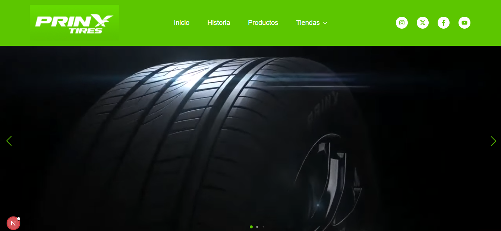
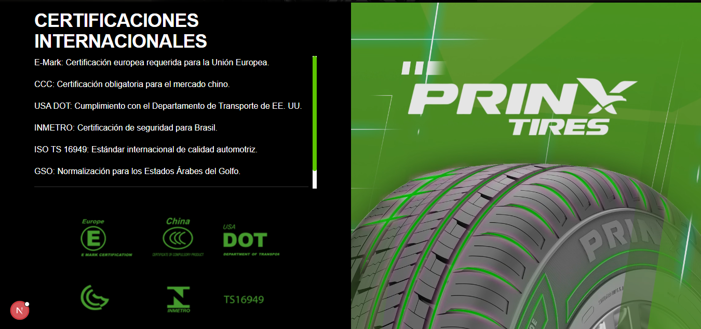
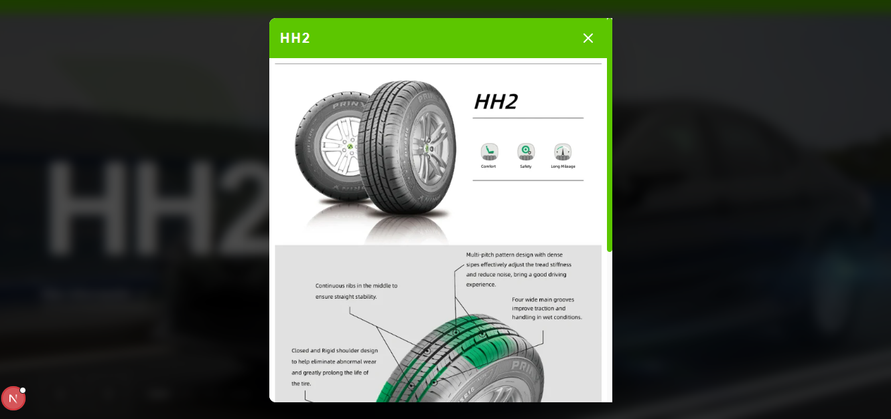
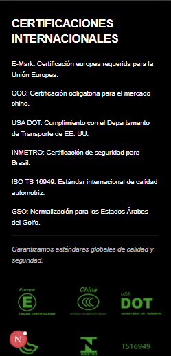
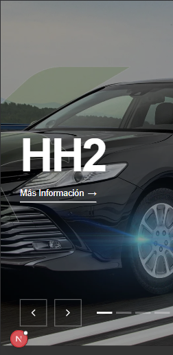
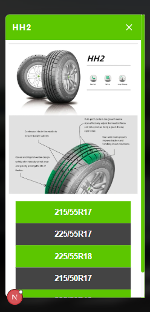

# 🏎️ Prinx Website - Next.js - Tailwind CSS

<p align="center">
  
</p>

<p align="center">
  
  
  
  
</p>

<p align="center">
  <a href="https://dunlop-gamma.vercel.app/">🌐 Ver Demo en Vivo</a>
</p>

## 📝 Descripción

Este proyecto consiste en una landing page moderna y de alto rendimiento para Prinx Tires, marca líder en innovación y tecnología de neumáticos de origen asiático con estándares globales. Desarrollada con Next.js, la plataforma ofrece una experiencia de usuario fluida y está 100% optimizada para dispositivos móviles, destacando la eficiencia, seguridad y la fuerte identidad visual (Verde y Negro) de la marca en el mercado.

La interfaz implementa un diseño limpio y profesional que facilita la navegación a través de secciones clave como Historia, Productos y Tiendas. Incluye un sistema dinámico para la visualización de modelos específicos (como el HH2) y una sección detallada de Certificaciones Internacionales (DOT, E-Mark, ISO, etc.), transmitiendo confianza y robustez técnica al consumidor.

## 🚀 Problema que Resuelve

El objetivo principal de este desarrollo es conectar la propuesta tecnológica de Prinx con el usuario final, optimizando la conversión mediante:

- **Geolocalización y Red de Tiendas:** Facilita la ubicación de puntos de venta autorizados a través de un menú desplegable intuitivo, permitiendo a los usuarios encontrar sus neumáticos de forma rápida.
- **Visualización Técnica de Producto:** Presenta de forma interactiva las bondades de modelos como el HH2, detallando beneficios como confort, seguridad y alto kilometraje mediante modales informativos optimizados.
- **Optimización del Performance Digital:** Al utilizar Next.js, se garantiza una velocidad de carga ultrarrápida, lo cual es crítico para la retención de usuarios en móviles y la mejora del posicionamiento orgánico (SEO).
- **Fidelización y Confianza:** Centraliza las certificaciones de calidad internacionales (INMETRO, CCC, etc.) y la historia de la marca, eliminando barreras de compra y reforzando la autoridad de Prinx en el sector automotriz.
- **Omnicanalidad:** Integra acceso directo a redes sociales (Instagram, X, Facebook, YouTube) y soporte al cliente, alineando la presencia digital con la atención en tiempo real.

## 🛠️ Stack Tecnológico

- **Framework:** [Next.js](https://nextjs.org/) (React)
- **Estilos:** [Tailwind CSS](https://tailwindcss.com/)
- **Despliegue:** [Vercel](https://vercel.com/)

## 📸 Capturas de Pantalla

<p align="center">
  
  
  
  
  
  
  
  
  
  
</p>

## ⚙️ Instalación y Uso

Si deseas correr este proyecto localmente, sigue estos pasos:

1.  **Clonar el repositorio:**
    ```bash
    git clone [https://github.com/leoch17/prinx.git](https://github.com/leoch17/prinx.git)
    cd prinx
    ```
2.  **Instalar dependencias:**
    ```bash
    npm install
    # o
    yarn install
    # o
    pnpm install
    ```
3.  **Configurar variables de entorno (si aplica):**
    Crea un archivo `.env.local` basado en `.env.example`.
4.  **Correr el servidor de desarrollo:**
    ```bash
    npm run dev
    ```
5.  Abre [http://localhost:3000](http://localhost:3000) en tu navegador.

---

Desarrollado por [Leonardo Chourio](https://github.com/leoch17)

## Implementación en Vercel

La forma más sencilla de implementar tu aplicación Next.js es utilizar la [plataforma Vercel](https://vercel.com/new?utm_medium=default-template&filter=next.js&utm_source=create-next-app&utm_campaign=create-next-app-readme), creada por los desarrolladores de Next.js.

Consulte nuestra [documentación sobre la implementación de Next.js](https://nextjs.org/docs/app/building-your-application/deploying) para obtener más detalles.
